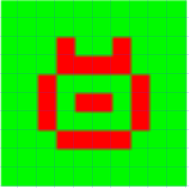
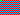
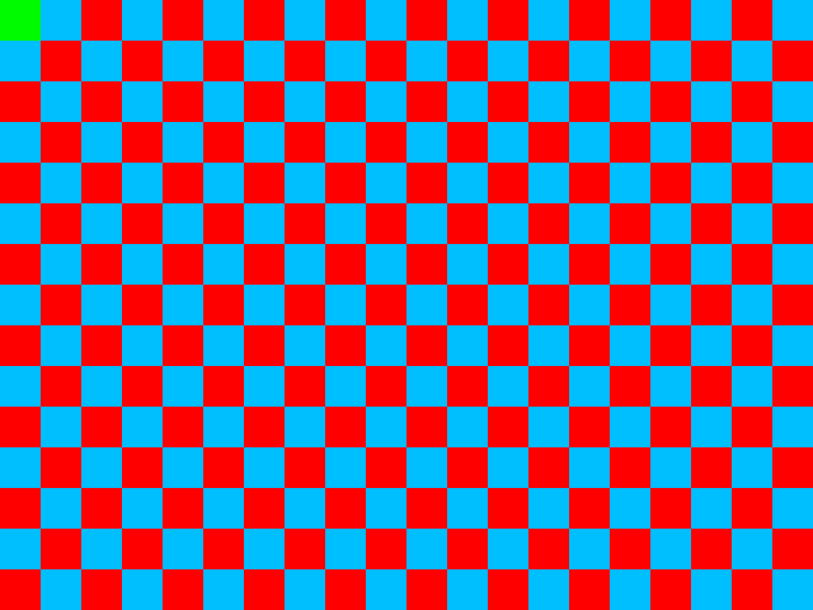

# Introdução

Esse é um mini-projeto de implementação que faz parte do *Projeto Jogo da Vida* da 2a Unidade de LP1.

O objetivo desse projeto é desenvolver uma classe que representa um abstração de um canvas para desenho.
Esse canvas deve ser capaz de suportar operações de desenho simples, como definir a cor de fundo e definir a cor de um pixel, por exemplo.

Uma vez realizado desenhos em um objeto do tipo canvas, o objeto deve ser capaz de retornar um ponteiro para os dados do desenho armazenados na memória. Por sua vez, a organização dos dados na memória segue o formato de uma imagem do tipo [PPM](https://en.wikipedia.org/wiki/Netpbm_format).

Isso quer dizer que cada pixel deve possuir 4 canais, R, G, B e Alpha, embora o canal Alpha não seja utilizado na prática no projeto Jogo da Vida.

# Contexto de Uso do Canvas

Para você entender melhor o funcionamento e motivação do canvas, é importante saber em que contexto ele será necessário.

O Projeto Jogo da Vida consiste em simular um [_cellular automaton_](https://en.wikipedia.org/wiki/Cellular_automaton), que basicamente é uma simulação discreta que ocorre sobre um tabuleiro de dimensões _W x H_ (largura x altura). Nesse tabuleiro, uma célula pode ser definida inicialmente como **viva** ou **morta**.
A cada passo da simulação, todas as células do tabuleiro são avaliadas de acordo com um conjunto de regras; o resultado dessa avaliação é que algumas células vivas morrerão e outras células nascerão.

Nesse momento, não vamos entrar em detalhes sobre como o processo de atualização e aplicação de regras vai funcionar (isso será descrito no Projeto Jogo da Vida). O importante é saber que a cada passo da simulação precisamos gerar uma **imagem** que represente o estado do tabuleiro naquela _iteração_ (ou geração) da simulação.
Nessa representação visual, as células vivas serão exibidas em uma certa cor, e as demais células (mortas ou inexistentes) com a cor de fundo.

É por esse motivo que o projeto precisa de um mecanismo para gerar uma imagem a partir dos dados da simulação. É nesse momento que surge a necessidade da classe `Canvas` cujo objetivo é justamente produzir uma imagem a partir dos dados da simulação. Nesse caso podemos afirmar que o Jogo da Vida (aplicação) será o **cliente** da classe `Canvas`.

Veja a imagem abaixo com um exemplo de saída da simulação.

 

A imagem acima corresponde a um tabuleiro do jogo da vida com _W=10_ por _H=10_. Os pixeis em vermelho representam as células vivas e as demais células são exibidas em verde claro.

Em resumo, precisamos de uma classe que suporte:
1. Definir uma cor de fundo ou de células vazias e/ou mortas;
2. "_Pintar_" os pixeis de uma imagem com uma cor específica (células vivas), e;
3. Enviar essa matriz de pixeis coloridos para uma função externa que grave essas informações em formato _png_, por exemplo.

Essas ações corresponderão a três métodos da classe `Canvas`.

# Canvas Virtual _vs_ Canvas Real

Se utilizarmos um mapeamento 1-para-1 entre uma célula viva do Projeto Jogo da Vida e um pixel na imagem de saída, a imagem resultante será muito pequena e difícil de visualizar.
Para demonstrar esse problema suponha que desejamos gerar um _checkerboard_ (tabuleiro quadriculado, similar ao de xadrez) de tamanho _W = 20_ x _H = 15_. Se o mapeamento for 1-para-1, ou seja, uma célula colorida para um pixel, a imagem resultado seria a exibida abaixo. É possível perceber que a imagem é muito pequena, com dimensões _20 x 15_ pixeis.

 

Para contornar o problema de conseguir visualizar tabuleiros de pequenas dimensões, podemos permitir que o usuário especifique um **pixel virtual**.
Para isso, basta que o cliente defina a dimensão do pixel virtual como sendo um inteiro `block_size` >= 1. Quanto maior o `block_size` maior será  a imagem resultante. Por exemplo, o mesmo _checkerboard_ acima foi gerada com `block_size` = 50, ou seja, um pixel no canvas virtual corresponde a um _quadrado_ 50x50 na imagem real.

Isso quer dizer que no exemplo o cliente especificou que desejava uma imagem _W_=20 x _H_=15 com `block_size` = 50. Como resultado, a imagem no canvas real acabou com dimensões 1000 x 750, visto que cada _pixel virtual_  ocupa um bloco de 50 x 50 _pixeis reais_.

 

# Implementando a Solução Proposta

Para permitir a criação de um canvas virtual maior, vamos solicitar ao cliente que informe o `block_size`, ou seja, a dimensão do pixel virtual. Dessa forma o cliente ainda vai indicar o tamanho do canvas correspondente ao número de linhas e colunas do seu tabuleiro, por exemplo _W=20_ x _H=15_, mas agora com a possibilidade de definir o tamanho do pixel, como acima com `block_size=50`.

A imagem resultante final (retornada pelo objeto `Canvas`) será na verdade uma imagem de largura `Width=1000` por altura `Height=750`, visto que cada "pixel" virtual ocupa, na verdade, um quadrado de 50 x 50 pixeis reais.

Considere o código abaixo como exemplo

```
Canvas canv{ 20, 15, 50 };          // Cria um canvas com W=20 x H=15 e block size = 50.

canv.clear( YELLOW );               // Pinta todo canvas de amarelo.
canv.pixel( 8, 5, BLUE );  // Solicita que o pixel (x=8,y=5) seja pintado de azul.
```

Nesse exemplo, o cliente pede que a posição `(8,5)` seja pintada de cor azul. Contudo, o que vai acontecer na verdade é que um quadrado de _50 x 50_ a partir da posição `(400,250)` será pintado de azul na imagem final. Em outras palavras, estamos abstraindo para o cliente um mapeamento entre a posição original `(8,5)` para a posição real `(400,250)` e, simultaneamente, mapeando 1 pixel para um quadrado de _50 x 50_.

# O Que Devo Fazer?

Sua tarefa, portanto, consiste em implementar a classe `Canvas` para suportar as funcionalidade definidas acima. Para tanto, você pode seguir a sugestão de interface para a classe presente no arquivo [`canvas.h`](include/canvas.h). O projeto também possui um outro cabeçalho, [`common.h`](include/common.h) que define algumas estruturas que podem ajudar na implementação, como uma estrutura para representar posição na matriz, uma para representar um pixel na imagem e uma para representar uma cor RGB. Para uma melhor compreensão do código oferecido, acesse a documentação do projeto [aqui](docs/html/index.html).

No projeto também existe um programa de teste, denominado [`driver_canvas.cpp`](src/driver_canvas.cpp) que cria um canvas e gera um _checkerboard_. A imagem resultante, se o canvas foi implementado corretamente, corresponderá a [essa imagem](pics/saida_50.png). Vale destacar que em uma imagem a **origem** do sistema de coordenadas é no _canto superior esquerdo_, ou seja, o eixo Y positivo aponta para baixo. É por esse motivo que o pixel `(0,0)` pintado de verde dentro do `driver_canvas.cpp` aparece no canto _superor_ esquerdo da imagem-exemplo.

Note que o projeto utiliza uma biblioteca externa, [lodepng](https://github.com/lvandeve/lodepng/blob/master/examples/example_encode.cpp), para gravar (codificar) uma imagem png. Contudo o script do cmake presente já está incluindo essa biblioteca na compilação.
